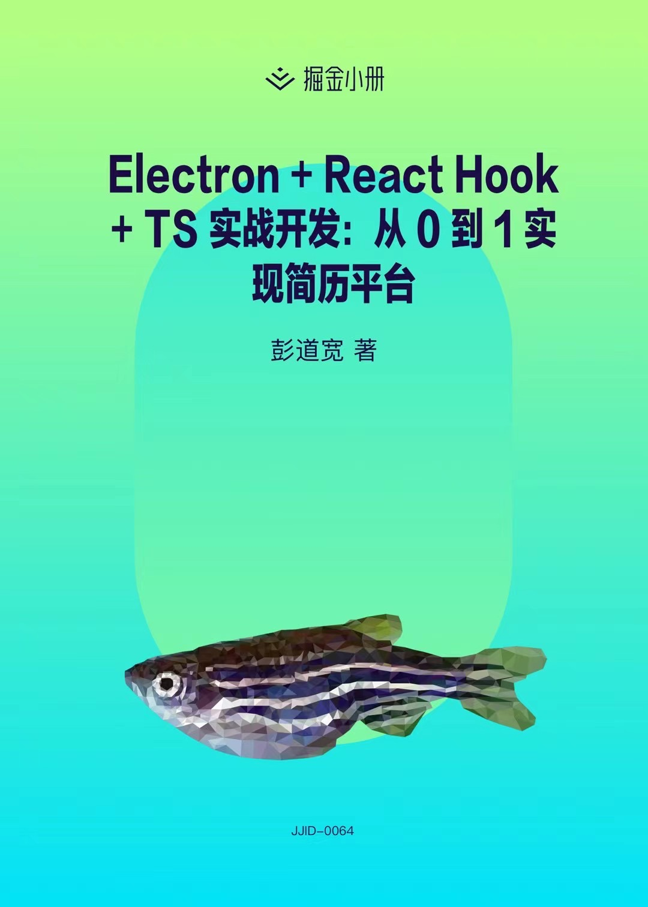

## Electron + React Hooks + TS 实战开发：从 0 到 1 实现简历平台

此分支为第一阶段配套代码。

**开发**

```bash
npm run install:electron
npm run start:main
npm run start:render
```

**更多分支**

- [master](https://github.com/PDKSophia/visResumeMook)：简历平台应用完整项目地址
- [electron-init](https://github.com/PDKSophia/visResumeMook/tree/electron-init)：关于`Electron`相关的初始化项目
- [electron-react-init](https://github.com/PDKSophia/visResumeMook/tree/electron-react-init)：关于 `Electron + React`相关的初始化项目
- [electron-react-complete-init](https://github.com/PDKSophia/visResumeMook/tree/electron-react-complete-init)：带有完整配置的初始化项目

### 小册章节



- [x] [开篇-小册介绍](https://juejin.cn/book/6950646725295996940)
- [x] [开篇-技术选型和项目结构](https://juejin.cn/book/6950646725295996940/section/6962895331667230727)
- [x] [基础篇-Electron 初步认识并掌握基础知识](https://juejin.cn/book/6950646725295996940/section/6961585436967829516)
- [x] [设计篇-需求功能设计与数据存储方案设计](https://juejin.cn/book/6950646725295996940/section/6962435230061821952)
- [x] [环境篇-动手搭建我们的简历平台](https://juejin.cn/book/6950646725295996940/section/6961586491285831720)
- [x] [🏆 500 米里程碑｜环境搭建篇完成](https://juejin.cn/book/6950646725295996940/section/6962898545577820198)
- [x] [业务篇-首页开发，好的印象能加分](https://juejin.cn/book/6950646725295996940/section/6962938228357726241)
- [x] [业务篇-如何写我们的 Redux 与 jsonFile](https://juejin.cn/book/6950646725295996940/section/6962906314565484551)
- [x] [业务篇-简历制作之数据设计与数据保存](https://juejin.cn/book/6950646725295996940/section/6962895451875966989)
- [x] [业务篇-简历制作之常用组件的设计与抽离](https://juejin.cn/book/6950646725295996940/section/6962940003034857480)
- [x] [业务篇-简历制作之数据的录入与展示](https://juejin.cn/book/6950646725295996940/section/6962940365221396511)
- [x] [业务篇-简历制作之导出 PDF](https://juejin.cn/book/6950646725295996940/section/6962940108383191048)
- [x] [🏆 1000 米里程碑 ｜简历主流程完成](https://juejin.cn/book/6950646725295996940/section/6962940484008280077)
- [x] [业务篇-简历模版列表实现与侧边栏交互效果](https://juejin.cn/book/6950646725295996940/section/6962940426999300109)
- [x] [业务篇-首页主题换肤功能实现](https://juejin.cn/book/6950646725295996940/section/6962761759404851239)
- [x] [业务篇-简历数据存档且自定义存储路径](https://juejin.cn/book/6950646725295996940/section/6962940676258398222)
- [x] [🏆 1500 米里程碑 ｜丰富功能](https://juejin.cn/book/6950646725295996940/section/6962939774650810380)
- [x] [优化篇-如何采用 Hooks 优化主题换肤逻辑](https://juejin.cn/book/6950646725295996940/section/6962940589528580132)
- [x] [优化篇-公共弹窗拆解优化，让职能更加单一](https://juejin.cn/book/6950646725295996940/section/6962941125426413599)
- [x] [优化篇-采用 Hooks 优化简历 Form 组件](https://juejin.cn/book/6950646725295996940/section/6962941213401939998)
- [x] [定制篇-自定义 Electron 原生应用菜单](https://juejin.cn/book/6950646725295996940/section/6962938070312157184)
- [x] [打包篇-Webpack 打包优化](https://juejin.cn/book/6950646725295996940/section/6962941321325576226)
- [x] [打包篇-Electron 打包体积优化](https://juejin.cn/book/6950646725295996940/section/6962941003858706436)
- [x] [🏆 到达目的地-应用程序发布](https://juejin.cn/book/6950646725295996940/section/6962941268389265415)
- [x] [结尾篇-行而不辍，未来可期](https://juejin.cn/book/6950646725295996940/section/6962941492159578143)
- [x] [彩蛋篇-Webpack 基础介绍与两大利器](https://juejin.cn/book/6950646725295996940/section/6962895331730620423)
- [x] [彩蛋篇-RcReduxModel 中间件开发设计](https://juejin.cn/book/6950646725295996940/section/6953057493043904549)
- [x] [期望篇-插件化实现远端拉取简历模版库](https://juejin.cn/editor/book/6950646725295996940/section/6953057609167405064)
- [x] [期望篇-可视化自定义独特的简历模版](https://juejin.cn/editor/book/6950646725295996940/section/6953057711445671943)

### 效果

1. 首页


2. 模版列表页


3. 制作简历页


4. 导出简历信息


5. 导出 `名字+学校+职位` PDF


> 上述是部分截图，其中的布局、样式、交互均纯手工制作，未采用任何 UI 库，导出的简历并不模糊，可放心使用

### 疑问

有任何疑问可以提 issues 或者添加我微信 PPPengDK 哈，同时欢迎大家提 Merge Request
